# OwlView
Захищена платформа для соціальних опитувань: інтеграція технологій шифрування та контролю доступу для забезпечення конфіденційності даних
---
## Опис проекту
OwlView — це безпечна платформа для проведення соціальних опитувань з використанням технологій шифрування, контролю доступу та блокчейн для забезпечення конфіденційності та цілісності даних.

## Основні функції
- Захищена реєстрація та авторизація користувачів (admin, client, organization).
- Шифрування даних (Fernet symmetric encryption).
- Хешування паролів з використанням bcrypt.
- Підтримка Google OAuth.
- Блокчейн для запису створення опитувань та відповідей.
- Підтримка токенів сесії з обмеженим терміном дії.
- Інтеграція AI для генерації відповідей на запити.

## Технології
- **Python** (Flask,  Flask-Cors, Flask-Limiter, SQLCipher3, bcrypt, cryptography, SQLCipher, bcrypt, JWT, Google Generative AI, etc)
- **Frontend**: React, Tailwind CSS, Chart.js, Google ReCaptcha, Framer Motion
- **Database**: SQLite з шифруванням SQLCipher
- **Блокчейн**: простий ланцюг блоків для фіксації подій

## Структура БД
- **Користувачі**: admins, clients, organizations, global_users (view)
- **Опитування**: surveys, survey_invites
- **Блокчейн**: blockchain_blocks, blockchain_responses
- **Безпека**: tokens, verification_codes
- **Інше**: user_blocks, tariffs, user_tariffs, messages, system_logs, news, notifications, notification_views, recharge_requests, withdrawals

## Шифрування та контроль доступу
- Паролі хешуються за допомогою bcrypt та зберігаються у базі в зашифрованому вигляді (base64).
- Дані користувачів, такі як опитування, відповіді та документи, шифруються за допомогою Fernet.
- База даних шифрується за допомогою SQLCipher з використанням ключа з `.env` файлу.
- Сесійні токени мають термін дії, що перевіряється при кожному запиті.

## Безпека
- Шифрування даних за допомогою AES (Fernet).
- Хешування паролів з використанням bcrypt.
- Аутентифікація на основі JWT токенів.
- Обмеження запитів через Flask-Limiter.

## Блокчейн для опитувань
- Ланцюг блоків створюється для кожного опитування.
- Дані відповідей додаються в блоки з відповідним хешем.
- Валідація блокчейну перевіряє цілісність усіх блоків.
- Кожне опитування записується в блокчейн.
- Відповіді хешуються та зберігаються в блокчейні.
- Забезпечується незмінність та аудиторський слід.

## Інтеграція AI
- Платформа використовує Google Generative AI для генерації відповідей на запити користувачів.
- API запит `/api/ask_ai` дозволяє користувачам надсилати питання моделі.

## Авторизація та аутентифікація
- Використання JWT токенів з перевіркою терміну дії.
- Інтеграція з Google OAuth для авторизації користувачів.
- Реалізована система підтвердження електронної пошти з кодами підтвердження.


---
## **API архітектура**
```mermaid
graph TD
  A[Авторизація та реєстрація] -->|POST| B1( /api/register )
  A -->|POST| B2( /api/login )
  A -->|POST| B3( /api/google-auth )
  A -->|POST| B4( /api/logout )

  C[Користувачі] -->|GET| D1( /api/users )
  C -->|POST| D2( /api/users/block )
  C -->|POST| D3( /api/users/unblock )
  C -->|POST| D4( /api/users/delete )

  E[Опитування] -->|POST| F1( /api/surveys/create )
  E -->|GET| F2( /api/surveys/:surveyId )
  E -->|POST| F3( /api/surveys/:surveyId/pass )
  E -->|GET| F4( /api/surveys/:surveyId/analytics )

  G[Блокчейн] -->|GET| H1( /api/blockchain/validate )
  G -->|GET| H2( /api/surveys/:surveyId/blockchain )

  I[Тарифи] -->|GET| J1( /api/tariffs )
  I -->|POST| J2( /api/tariffs/:id/purchase )

  K[Виводи] -->|POST| L1( /api/withdraw )
  K -->|GET| L2( /api/user/withdrawals/:userId )
  K -->|POST| L3( /api/recharge_request )

  M[Сповіщення] -->|GET| N1( /api/notifications )
  M -->|POST| N2( /api/notifications )

  O[AI] -->|POST| P1( /api/ask_ai )
```
## API Flow Diagrams

## Авторизація та реєстрація
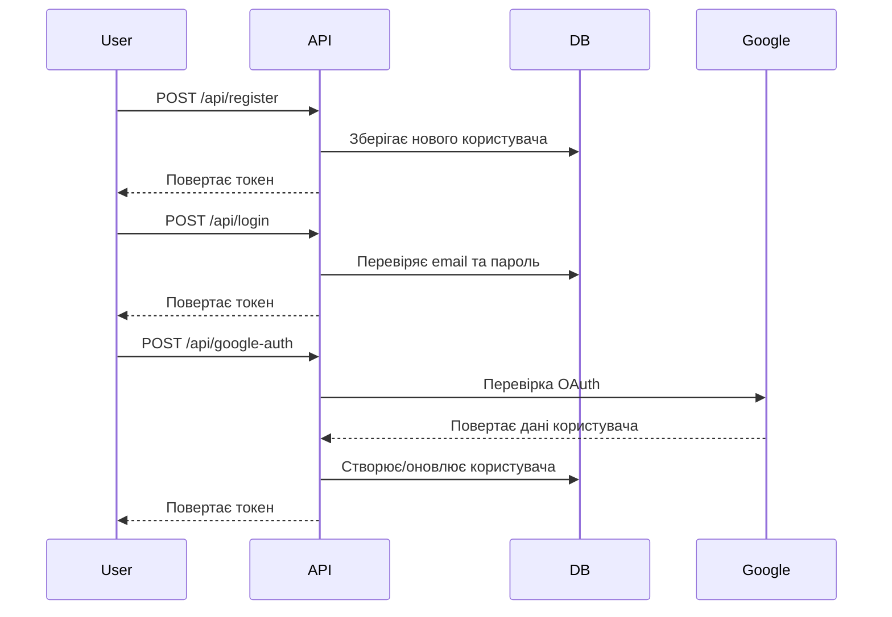

## Перевірка стану користувача
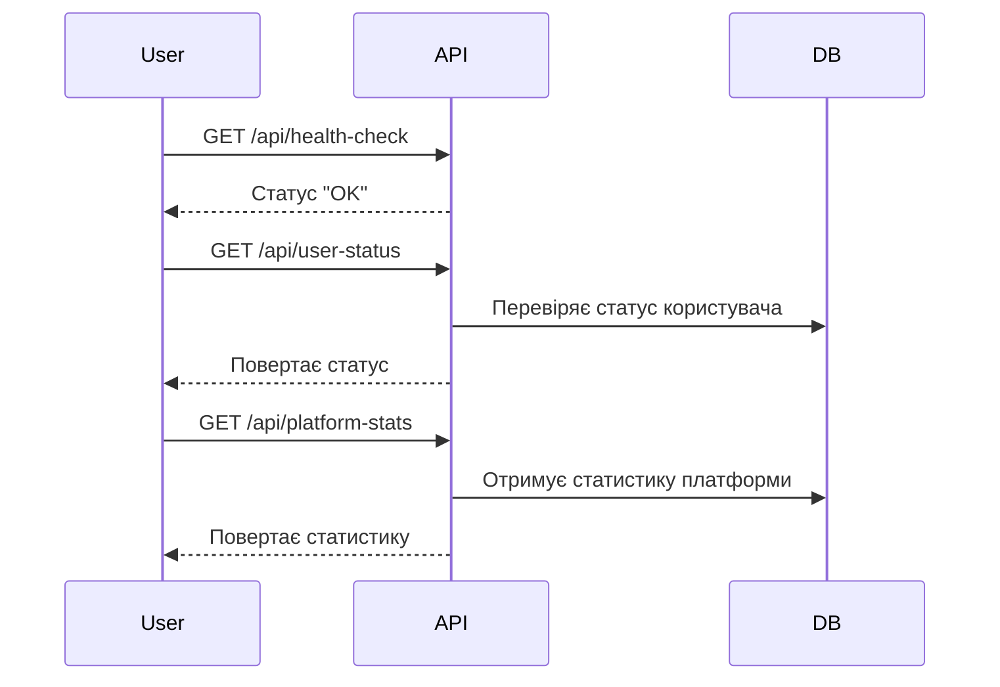

## Підтвердження електронної пошти
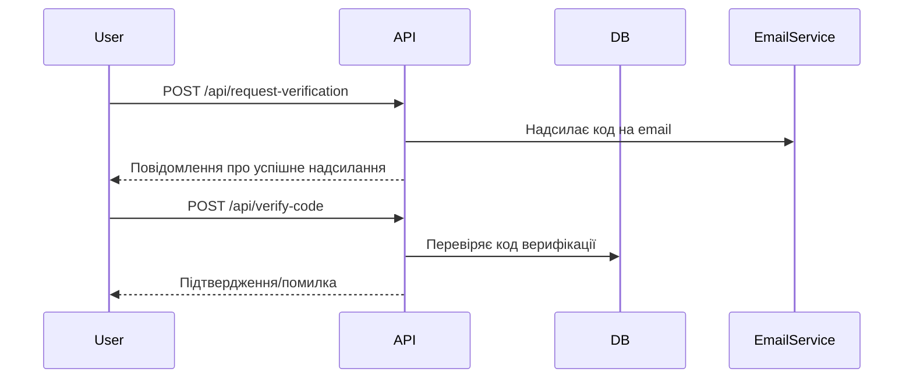

## AI запити
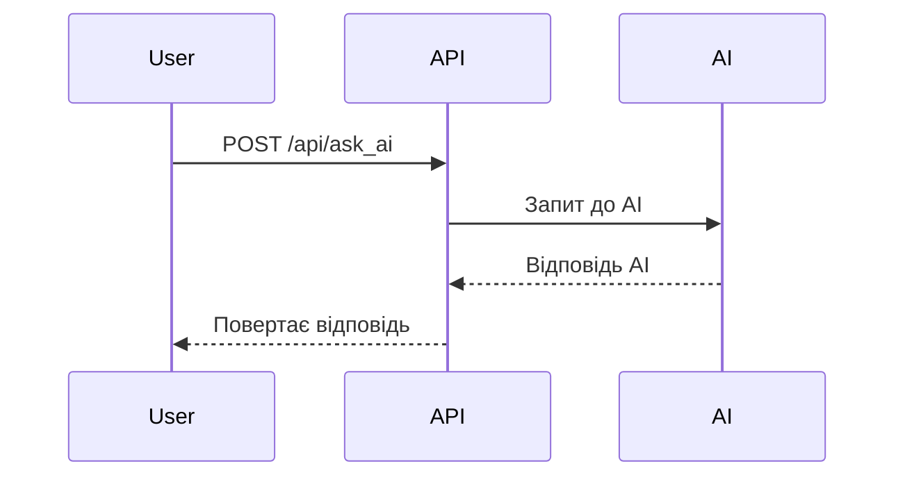

## Управління профілем користувача
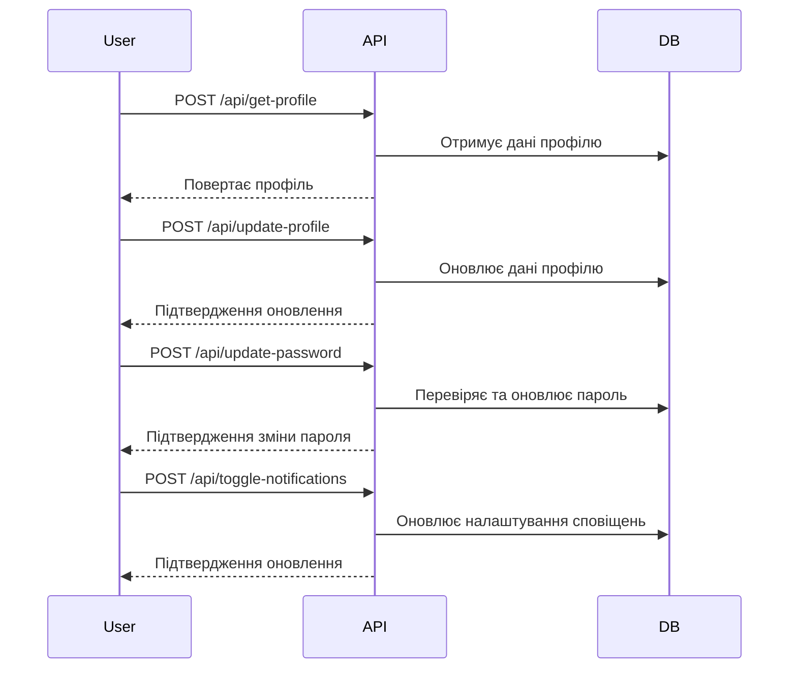

## Виведення коштів
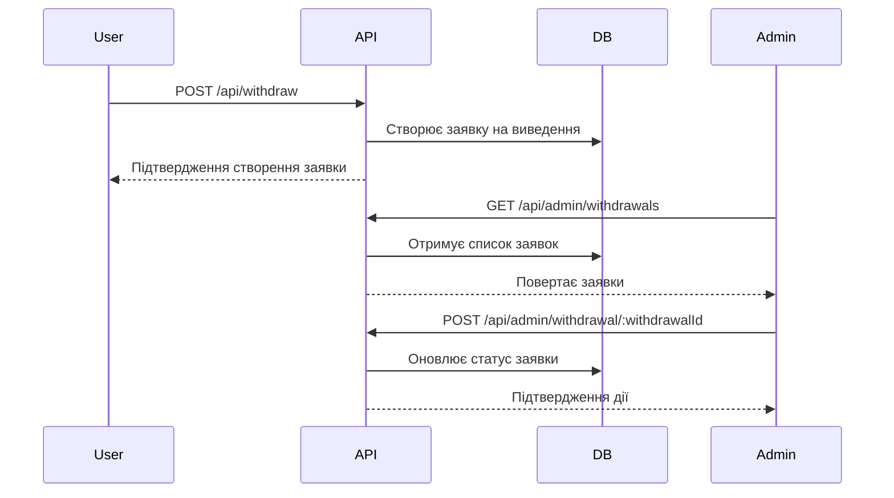

## Опитування та блокчейн
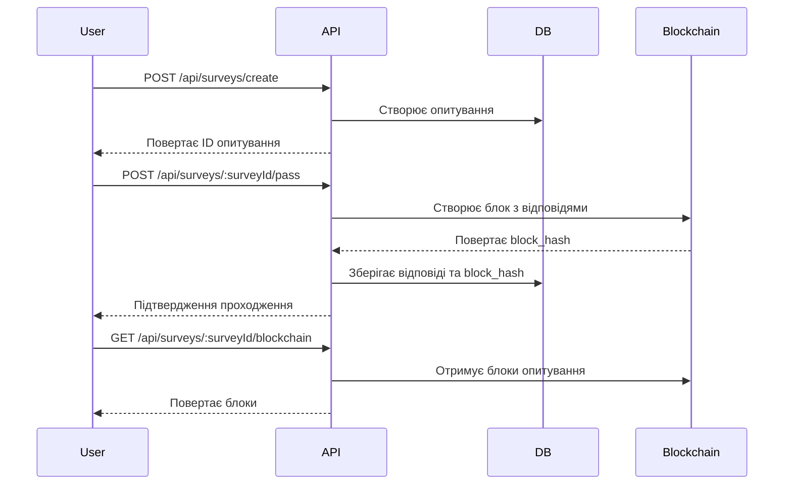

## Сповіщення
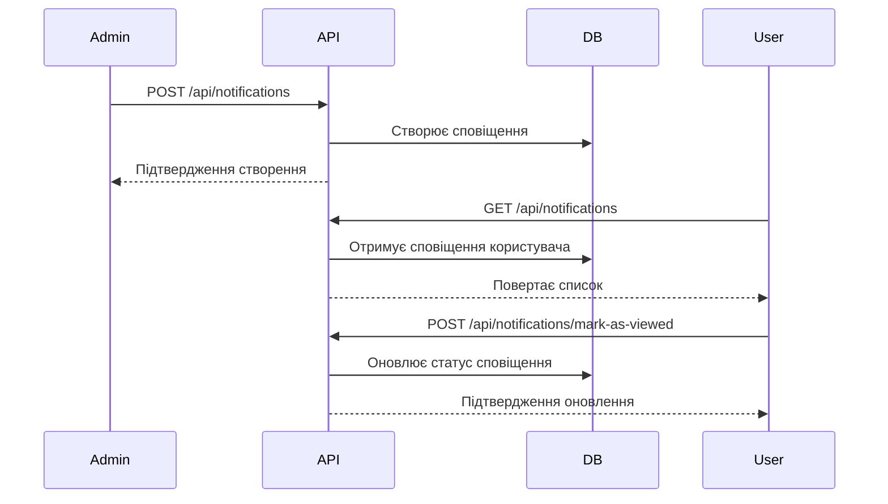

## Верифікація організацій
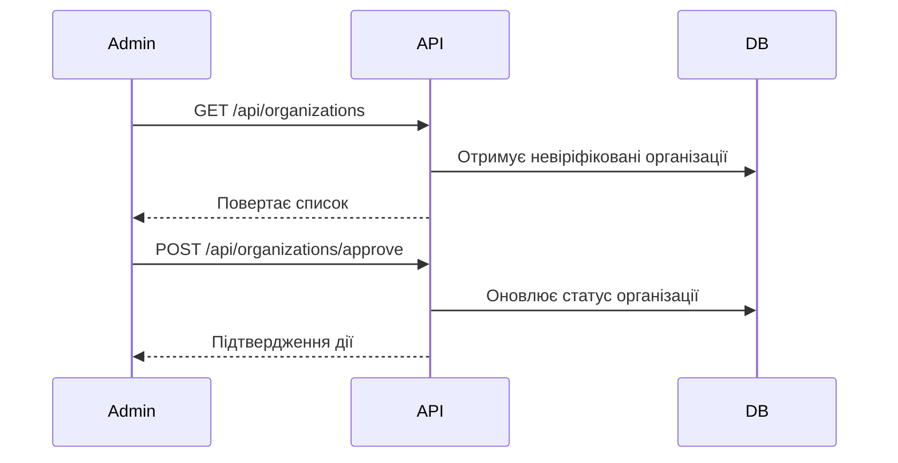

## Логи та аналітика
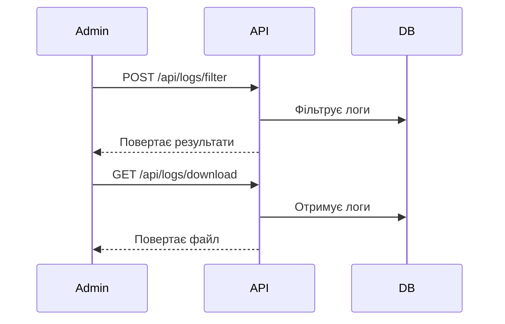


---

## Виведення коштів (організація/користувач)

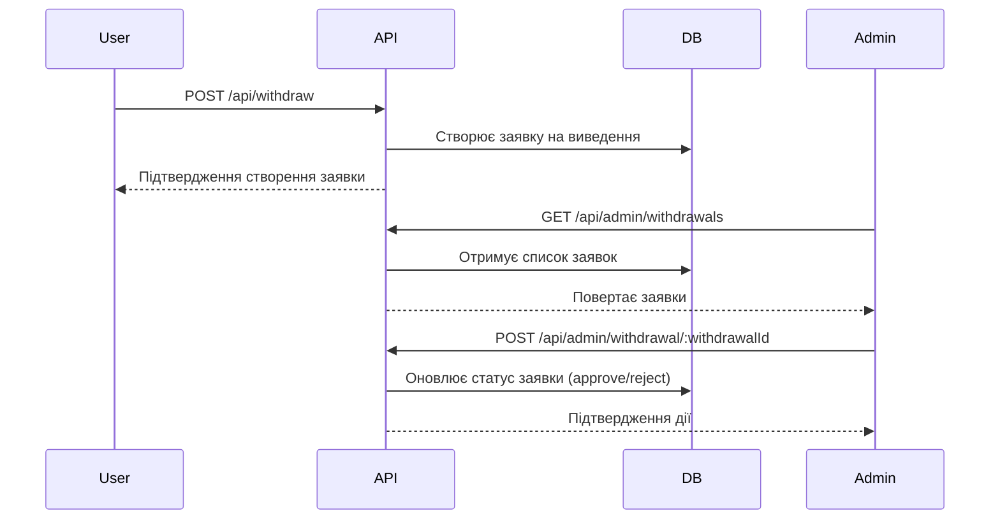

---

## Сповіщення


---
## **BACKEND & API**

### Авторизація та реєстрація
- `POST /api/register` 
  - Реєстрація користувача (admin, client, organization).
- `POST /api/login`   
  - Вхід користувача за email та паролем.
- `POST /api/google-auth`   
  - Вхід за допомогою Google OAuth.
- `POST /api/logout` 
  - Вихід з системи.

### Перевірка стану
- `GET /api/health-check` 
  - Перевірка доступності API.
- `GET /api/user-status` 
  - Отримання статусу користувача (роль, блокування, верифікація).
- `GET /api/platform-stats` 
  - Отримання статистики платформи.

### Підтвердження електронної пошти
- `POST /api/request-verification` 
  - Запит на отримання коду підтвердження.
- `POST /api/verify-code` 
  - Підтвердження коду.

### AI
- `POST /api/ask_ai` 
  - Запит до AI для генерації відповідей.

### Управління профілем користувача
- `POST /api/update-profile`
  - Оновити дані профілю користувача.

- `POST /api/get-profile`
  - Отримати дані профілю користувача.

- `POST /api/toggle-notifications`
  - Увімкнути або вимкнути сповіщення для користувача.

- `POST /api/update-password`
  - Оновити пароль користувача з перевіркою.

- `POST /api/profile-complete`
  - Перевірити, чи профіль користувача заповнено повністю.

- `GET /api/user/points/<user_id>`
  - Отримати кількість балів користувача.

### Виведення коштів
- `POST /api/withdraw`
  - Створити запит на виведення балів.

- `GET /api/user/withdrawals/<user_id>`
  - Отримати історію виведення балів користувача.

- `GET /api/admin/withdrawals`
  - Адміністратор: Отримати всі запити на виведення балів.

- `POST /api/admin/withdrawal/<withdrawal_id>`
  - Адміністратор: Обробити (схвалити/відхилити) запит на виведення.

### Запити на поповнення (Організації)
- `POST /api/recharge_request`
  - Створити запит на поповнення балів.

- `GET /api/recharge_requests`
  - Адміністратор: Отримати всі запити на поповнення.

- `POST /api/recharge_request/<request_id>`
  - Адміністратор: Оновити статус запиту на поповнення.

- `GET /api/recharge_requests/organization/<organization_id>`
  - Отримати запити на поповнення для конкретної організації.

### Тарифи
- `GET /api/tariffs`
  - Отримати доступні тарифи.

- `POST /api/tariffs`
  - Додати новий тариф.

- `DELETE /api/tariffs/<tariff_id>`
  - Видалити тариф.

- `PUT /api/tariffs/<tariff_id>`
  - Оновити деталі тарифу.

- `POST /api/tariffs/<tariff_id>/purchase`
  - Придбати тариф.

- `POST /api/tariffs/<tariff_id>/cancel`
  - Скасувати придбаний тариф.

### Управління користувачами
- `GET /api/users`
  - Отримати всіх користувачів.

- `POST /api/users/block`
  - Заблокувати користувача.

- `POST /api/users/unblock`
  - Розблокувати користувача.

- `POST /api/users/delete`
  - Видалити користувача (soft-delete).

- `POST /api/users/make_admin`
  - Призначити клієнта адміністратором.

- `POST /api/users/remove_admin`
  - Зняти повноваження адміністратора.

- `POST /api/users/filter`
  - Фільтрувати користувачів за різними критеріями.

### Управління опитуваннями
- `POST /api/surveys/create`
  - Створити нове опитування.

- `GET /api/surveys/<survey_id>`
  - Отримати деталі опитування.

- `PUT /api/surveys/<survey_id>`
  - Оновити деталі опитування.

### Дії з опитуваннями
- `POST /api/surveys/<survey_id>/status`
  - Змінити статус опитування.

- `POST /api/surveys/<survey_id>/invite`
  - Надіслати запрошення респондентам на опитування.

- `GET /api/surveys/invitations`
  - Отримати список запрошень користувача.

- `POST /api/surveys/<survey_id>/pass`
  - Пройти опитування та зберегти відповіді.

- `POST /api/surveys/<survey_id>/claim-reward`
  - Отримати винагороду за проходження опитування.

- `GET /api/surveys/<survey_id>/analytics`
  - Переглянути аналітику опитування.

- `GET /api/surveys/<survey_id>/blockchain`
  - Отримати блоки блокчейну опитування.

- `GET /api/surveys/<survey_id>/verify`
  - Перевірити цілісність блокчейну опитування.

- `GET /api/blockchain/validate`
  - Перевірити цілісність всього блокчейну.

- `GET /api/surveys/<survey_id>/answers/download?format=<format>`
  - Завантажити відповіді на опитування (формати: csv, txt, json).

- `GET /api/surveys/<survey_id>/analytics/download?format=<format>`
  - Завантажити аналітику опитування у вигляді дашборду (html).

- `POST /api/surveys/<survey_id>/postpone`
  - Відкласти проходження опитування.

- `GET /api/surveys/<survey_id>/continue`
  - Продовжити проходження відкладеного опитування.

- `GET /api/surveys/<survey_id>/all-answers`
  - Отримати всі відповіді по опитуванню (для власника).

- `POST /api/surveys/<survey_id>/notify`
  - Надіслати повідомлення користувачам опитування.

### Сповіщення
- `POST /api/notifications`
  - Створити сповіщення (системне або email).

- `GET /api/notifications`
  - Отримати список сповіщень користувача.

- `POST /api/notifications/mark-as-viewed`
  - Відмітити сповіщення як переглянуте.

- `DELETE /api/notifications/<notification_id>`
  - Видалити конкретне системне сповіщення (адміністратор).

- `DELETE /api/notifications`
  - Видалити всі системні сповіщення (адміністратор).

### Верифікація організацій
- `GET /api/organizations`
  - Отримати невіріфіковані організації.

- `POST /api/organizations/approve`
  - Схвалити верифікацію організації.

- `POST /api/organizations/reject`
  - Відхилити верифікацію організації.

### Повідомлення підтримки
- `GET /api/support/messages`
  - Отримати повідомлення підтримки (фільтр за папками).

- `POST /api/support/reply`
  - Відповісти на повідомлення підтримки.

- `POST /api/support/send`
  - Надіслати повідомлення підтримки.

- `POST /api/support/delete`
  - Видалити повідомлення підтримки.

- `POST /api/support/postpone`
  - Відкласти повідомлення підтримки.

- `POST /api/support/update_status`
  - Оновити статус повідомлення підтримки.

- `GET /api/support/unread-messages`
  - Отримати кількість непрочитаних повідомлень.

### Логи та аналітика
- `POST /api/logs/filter`
  - Фільтрувати системні логи за параметрами (адміністратор).

- `GET /api/logs/download`
  - Завантажити системні логи у форматі TXT (адміністратор).

- `GET /api/home-data`
  - Отримати основні дані для домашньої сторінки (повідомлення, сповіщення, опитування).

- `GET /api/access_question_types`
  - Отримати дозволені типи питань для поточного користувача відповідно до тарифу.


## **FRONTEND | Документація по сторінках React**

## 1. VerificationPage
**Призначення:**  
Адмінська сторінка для верифікації організацій.

**Основні можливості:**
- Перегляд списку організацій, які чекають на верифікацію.
- Підтвердження або відхилення організації з вказанням причини відмови.
- Доступ лише для адміністратора (`user.role === "admin"`).

**Маршрут API:**
- GET `/organizations` — отримання організацій.
- POST `/organizations/approve` — підтвердження організації.
- POST `/organizations/reject` — відхилення організації.

## 2. VerificationAlert
**Призначення:**  
Компонент для підтвердження email користувача за допомогою коду верифікації.

**Основні можливості:**
- Запитати код верифікації на email.
- Ввести код та підтвердити його.
- Відображає повідомлення про успішну верифікацію або помилку.

**Вхідні пропси:**
- `onRequestCode` — функція для запиту коду.
- `onVerify` — функція для підтвердження коду.
- `message` — текст повідомлення.
- `adminApprovalRequired` — чи потрібна додаткова верифікація адміном.
- `onVerifiedSuccess` — колбек після успішної верифікації.

## 3. WithdrawPoints
**Призначення:**  
Сторінка для виведення балів користувача.

**Основні можливості:**
- Вивід балів на мобільний номер.
- Вивід балів на благодійність (Monobank).
- Перевірка балансу користувача.
- Відображення повідомлень про успіх/помилку.

**Маршрут API:**
- GET `/user/points/:userId` — отримання балів користувача.
- POST `/withdraw` — надсилання заявки на вивід.

## 4. UserWithdrawals
**Призначення:**  
Адмінська сторінка для перегляду та модерації заявок на виведення балів.

**Основні можливості:**
- Перегляд усіх заявок на виведення.
- Схвалення або відхилення заявки.

**Маршрут API:**
- GET `/admin/withdrawals` — отримання списку заявок.
- POST `/admin/withdrawal/:withdrawalId` — дія над заявкою (approve/reject).

## 5. Users
**Призначення:**  
Сторінка керування користувачами (адмін, організація).

**Основні можливості:**
- Перегляд користувачів.
- Фільтрація за багатьма параметрами (статус, роль, вік, локація, освіта тощо).
- Блокування/розблокування користувачів.
- Призначення/зняття ролі адміністратора.
- Видалення користувачів.

**Маршрут API:**
- GET `/users` — отримання користувачів.
- POST `/users/delete` — видалення користувача.
- POST `/users/make_admin` — призначення адміном.
- POST `/users/remove_admin` — зняття ролі адміна.
- POST `/users/block` — блокування користувача.
- POST `/users/unblock` — розблокування користувача.

## 6. TariffsPage
**Призначення:**  
Сторінка для керування тарифами (плани VIP доступу).

**Основні можливості:**
- Перегляд доступних тарифів.
- Адміну доступне створення, редагування, видалення тарифів.
- Користувач може придбати тариф або скасувати його.

**Маршрут API:**
- GET `/tariffs` — отримання тарифів.
- POST `/tariffs` — створення тарифу.
- PUT `/tariffs/:id` — редагування тарифу.
- DELETE `/tariffs/:id` — видалення тарифу.
- POST `/tariffs/:id/purchase` — купівля тарифу.
- POST `/tariffs/:id/cancel` — скасування тарифу.

## 7. Surveys
**Призначення:**  
Сторінка для управління опитуваннями.

**Основні можливості:**
- Створення, редагування, попередній перегляд опитувань.
- Прийняття запрошень на опитування.
- Перегляд пройдених опитувань.
- Отримання винагороди за опитування.

**Маршрут API:**
- GET `/surveys/my` — отримання опитувань користувача.
- GET `/surveys/invitations` — отримання запрошень на опитування.
- POST `/surveys/:surveyId/claim-reward` — отримати винагороду.
- POST `/surveys/:surveyId/purchase` — участь у опитуванні.

## 8. SurveyPass
**Призначення:**  
Сторінка для проходження опитування користувачем.

**Основні можливості:**
- Завантаження опитування з API.
- Відображення запитань опитування (у двох режимах: *single* — усі запитання на одній сторінці або *multi* — по одному питанню).
- Підтримка різних типів питань: радіо, чекбокси, текстові, шкали, таблиці, рейтинги тощо.
- Відправка відповідей на сервер.
- Можливість відкласти проходження опитування збереженням поточного прогресу.

**Маршрути API:**
- `GET /surveys/:surveyId` — отримання інформації про опитування.
- `GET /surveys/:surveyId/continue` — отримання попередніх відповідей і поточного стану.
- `POST /surveys/:surveyId/postpone` — збереження часткових відповідей і відкладення опитування.
- `POST /surveys/:surveyId/pass` — відправка фінальних відповідей.

## 9. SurveyPreview
**Призначення:**  
Сторінка для попереднього перегляду структури опитування перед його публікацією.

**Основні можливості:**
- Завантаження опитування з API.
- Відображення всіх типів запитань опитування у режимах *single* (всі питання одразу) та *multi* (по одному питанню).
- Перегляд мультимедійного контенту (відео, аудіо, зображення), що прикріплені до запитань та відповідей.
- Відображення таблиць, шкал, слайдерів, рейтингів тощо.

**Маршрут API:**
- `GET /surveys/:surveyId` — отримання інформації про опитування.

## 10. Support
**Призначення:**  
Сторінка для перегляду, обробки та створення повідомлень технічної підтримки між користувачами та адміністрацією.

**Основні можливості:**
- Перегляд повідомлень у різних вкладках:  
  - Вхідні, Вихідні, Відкладені, Видалені, Прочитані.
- Відкриття конкретного повідомлення та перегляд деталей (відправник, отримувач, тема, текст, дата).
- Дії над повідомленнями:
  - **Прочитати** (помітити як прочитане).
  - **Відкласти** (перенести у вкладку "Відкладені").
  - **Видалити** (перемістити у вкладку "Видалені").
  - **Відповісти** на отримане повідомлення.
- Створення нового повідомлення або відповіді на існуюче.

**Маршрути API:**
- `GET /support/messages?folder=<folder>` — отримання повідомлень для вибраної вкладки (`inbox`, `outbox`, `postponed`, `deleted`, `read`).
- `POST /support/update_status` — оновлення статусу повідомлення (наприклад, "read").
- `POST /support/postpone` — відкладання повідомлення.
- `POST /support/delete` — видалення повідомлення.
- `POST /support/send` — надсилання нового повідомлення.
- `POST /support/reply` — відповідь на існуюче повідомлення.

## 11. ServerDown
**Призначення:**  
Сторінка для відображення повідомлення про тимчасову недоступність сервера.

**Основні можливості:**
- Відображення інформаційного повідомлення про збій сервера.
- Анімація процесу очікування (loading bar).
- Кнопка для повторної спроби оновлення сторінки.

**Маршрути API:**  
- Відсутні (статична сторінка для відображення помилки).

## 12. SurveyAnswersPage
**Призначення:**  
Сторінка для перегляду відповідей користувачів на опитування та надсилання їм сповіщень.

**Основні можливості:**
- Завантаження опитування та відповідей усіх користувачів.
- Вибір конкретного користувача для перегляду його відповідей.
- Відображення відповідей користувача з мультимедійним контентом (відео, аудіо, зображення).
- Надсилання сповіщень конкретному користувачу або всім одразу:
  - Через систему (внутрішнє повідомлення).
  - На електронну пошту.

**Маршрути API:**
- `GET /surveys/:surveyId/all-answers` — отримання всіх відповідей користувачів на опитування.
- `GET /surveys/:surveyId` — отримання даних про опитування.
- `POST /surveys/:surveyId/notify` — надсилання сповіщення користувачам (параметри: `userId`, `notifyType`, `text`, або `all: true` для всіх).

## 13. RechargeRequests
**Призначення:**  
Сторінка для управління заявками на поповнення балів організацій. Організації можуть подавати заявки, а адміністратори їх обробляти.

**Основні можливості:**
- Для організацій:
  - Перегляд свого текущого балансу.
  - Запит на поповнення балів.
  - Перегляд статусів заявок.
- Для адміністраторів:
  - Перегляд усіх заявок.
  - Схвалення або відхилення заявок.

**Маршрути API:**
- `GET /user/points/{userId}` — отримання балансу користувача.
- `GET /recharge_requests/organization/{userId}` — отримання заявок організації.
- `GET /recharge_requests` — отримання усіх заявок (admin).
- `POST /recharge_request` — створення нової заявки на поповнення.
- `POST /recharge_request/{requestId}` — оновлення статусу заявки (затвердження/відхилення).

## 14. Registration
**Призначення:**  
Сторінка для реєстрації клієнтів та організацій з можливістю голосового сертифікату та оріентації за соціальними критеріями.

**Основні можливості:**
- Реєстрація клієнтів (з даними про стать, народження, сімейний статус тощо).
- Реєстрація організацій (з даними про керівника, документами та соціальними засобами).
- Валідація даних (електронна пошта, телефон, пароль).
- Автологін після успішної реєстрації.
- Спілка з Google OAuth для клієнтів.

**Маршрути API:**
- `POST /register` — реєстрація користувача.
- `POST /login` — логін після реєстрації.
- `POST /google-auth` — авторизація через Google OAuth.

## 15. Notifications 
**Призначення:**
Керування сповіщеннями для користувачів системи (створення, відображення, видалення).

**Основні можливості:**
- Перегляд усіх сповіщень користувача.
- Створення нових сповіщень (тільки для адмінів).
- Підтримка двох каналів надсилання: системне сповіщення та електронна пошта.
- Додавання зображення та підпису до сповіщення.
- Відмітка сповіщень як "переглянуті".
- Видалення окремих сповіщень або всіх системних сповіщень (для адмінів).

**Маршрути API:**
- `GET /notifications` — отримати список сповіщень.
- `POST /notifications` — створити нове сповіщення.
- `POST /notifications/mark-as-viewed` — позначити сповіщення як переглянуте.
- `DELETE /notifications/:id` — видалити конкретне сповіщення.
- `DELETE /notifications` — видалити всі системні сповіщення.

## 16. News 
**Призначення:**
Відображення та керування новинами в системі. Підтримка як ручного додавання новин, так і автоматичного імпорту з зовнішніх джерел.

**Основні можливості:**
- Перегляд списку новин.
- Адміністратор може:
  - Додавати новини вручну.
  - Видаляти новини.
  - Підтягувати новини з зовнішніх джерел (pravda, ukrinform, suspilne).

**Маршрути API:**
- `GET /news` — отримати список новин.
- `POST /news` — створити новину вручну.
- `POST /news/fetch` — підтягнути новини з зовнішніх джерел.
- `DELETE /news/:id` — видалити новину.

## 17. MyWithdrawals 
**Призначення:**
Відображення історії заявок на виведення балів користувача.

**Основні можливості:**
- Перегляд списку виводів із датою, сумою балів, еквівалентом у гривнях, типом виводу (мобільний чи благодійність), статусом заявки.
- Для благодійних виводів — активне посилання на благодійну організацію.

**Маршрут API:**
- `GET /user/withdrawals/:userId` — отримати історію виводів користувача.


## 18. Login 
**Призначення:**
Авторизація користувачів у системі за допомогою email/пароля або Google-акаунту.

**Основні можливості:**
- Вхід через email та пароль.
- Вхід через Google OAuth.
- Валідація полів форми.

**Маршрути API:**
- `POST /login` — авторизація користувача за email/паролем.
- `POST /google-auth` — авторизація через Google.


## 19. PersonalCabinet 
**Призначення:**
Редагування персональних даних користувача (профіль) та керування сповіщеннями.

**Основні можливості:**
- Перегляд та редагування персональних даних.
- Підтримка різних полів профілю для клієнтів, організацій та адміністраторів.
- Оновлення пароля.
- Включення/вимкнення сповіщень.
- Відображення статусу заповнення профілю.

**Маршрути API:**
- `POST /get-profile` — отримати дані профілю користувача.
- `POST /update-profile` — оновити дані профілю користувача.
- `POST /update-password` — оновити пароль.
- `POST /toggle-notifications` — увімкнути/вимкнути сповіщення.
- `POST /profile-complete` — перевірити, чи профіль заповнений повністю.

## 20. AdminUserSurveys
**Призначення:**  
Адмін-панель для перегляду всіх опитувань користувачів.

**Основні можливості:**
- Завантаження списку опитувань усіх користувачів.
- Перегляд ID опитування, власника, дати створення та статусу.
- Можливість переходу до попереднього перегляду конкретного опитування.

**Маршрут API:**
- `GET /admin/surveys` — отримати список опитувань користувачів.

## 21. AnalyticsTab
**Призначення:**  
Відображення аналітики по опитуванню.

**Основні можливості:**
- Відображення статистики: кількість запрошених, тих, хто пройшов опитування, відклали або перебувають у процесі.
- Побудова графіків для аналізу відповідей.
- Завантаження відповідей (формат `txt`) та дашбордів (формат `html`).

**Маршрути API:**
- `GET /surveys/:surveyID/analytics` — отримати аналітику по опитуванню.
- `GET /api/surveys/:surveyID/answers/download?format=txt` — завантажити відповіді.
- `GET /api/surveys/:surveyID/analytics/download?format=html` — завантажити дашборди.

## 22. ArtificialIntelligenceTab
**Призначення:**  
Інтерактивне спілкування з AI для отримання допомоги чи рекомендацій по опитуванню.

**Основні можливості:**
- Введення запитів до AI.
- Отримання відповідей від AI та збереження історії діалогу.

**Маршрут API:**
- `POST /api/ask_ai` — надіслати запит до AI.

## 23. Balance
**Призначення:**  
Управління балансом користувача та адміністрування фінансових операцій.

**Основні можливості:**
- Виведення балів.
- Перегляд історії виведень.
- Для організацій та адмінів — перегляд поповнень та виведень інших користувачів.

**Маршрути API:**
- Залежить від підключених компонентів (`WithdrawPoints`, `MyWithdrawals`, `RechargeRequests`, `UserWithdrawals`).

## 24. Blocked
**Призначення:**  
Інформування користувача про блокування акаунта.

**Основні можливості:**
- Відображення причин блокування (постійне або тимчасове).
- Можливість написати в підтримку для оскарження.

## 25. Home
**Призначення:**  
Головна сторінка платформи OwlView.

**Основні можливості:**
- Відображення статистики платформи (користувачі, опитування, відповіді).
- Перевірка статусу верифікації користувача.
- Перенаправлення на заповнення профілю, якщо він не завершений.
- Відображення функціональностей платформи.

**Маршрути API:**
- `GET /platform-stats` — отримати загальну статистику платформи.
- `GET /user-status` — перевірити статус верифікації користувача.
- `POST /profile-complete` — перевірити заповнення профілю.
- `POST /request-verification` — запитати код верифікації.
- `POST /verify-code` — підтвердити код верифікації.

## 26. AdminLogs
**Призначення:**  
Перегляд та фільтрація системних логів (реєстрація, вхід, дії з опитуваннями, тарифи тощо) адміністратором.

**Основні можливості:**
- Фільтрація логів за типом, датами, ID користувача чи проекту.
- Перегляд у таблиці.
- Експорт у `.txt` файл.

**Маршрут API:**
- `POST /logs/filter` — отримання логів за заданими фільтрами.

## 27. AdminSurveyPreview
**Призначення:**  
Перегляд структури та змісту опитування адміністратором, з можливістю видалення.

**Основні можливості:**
- Попередній перегляд усіх типів питань.
- Підтримка режимів "односторінкове" та "пошагове" відображення.
- Видалення опитування з повідомленням власнику.

**Маршрути API:**
- `GET /surveys/:surveyId` — отримати дані опитування.
- `POST /admin/surveys/:surveyId/delete-with-notification` — видалити опитування та надіслати повідомлення.

## 28. Footer
**Призначення:**  
Універсальний футер для всієї платформи з інформаційними посиланнями, соціальними мережами та політикою конфіденційності.

**Основні можливості:**
- Навігаційні секції: про компанію, продукти, підтримка, ресурси.
- Модальне вікно політики конфіденційності.
- Іконки соцмереж з анімацією.

## 29. Header
**Призначення:**  
Верхня навігаційна панель платформи з адаптацією під роль користувача.

**Основні можливості:**
- Відображення відповідних вкладок залежно від ролі (адмін, клієнт, організація).
- Індикатори непрочитаних повідомлень, сповіщень, верифікацій.
- Вихід із системи, доступ до профілю, респонсивний сайдбар.

**Маршрут API:**
- `GET /home-data` — отримати дані для відображення бейджів (сповіщення, верифікації тощо).
- `POST /logout` — вихід із системи.
---
# Архітектура бази даних (скорочено)
```mermaid
erDiagram
    global_user_seq {
        INTEGER global_id PK
    }
    admins {
        INTEGER id PK
        TEXT email
        TEXT password
    }
    clients {
        INTEGER id PK
        TEXT email
        TEXT password
    }
    organizations {
        INTEGER id PK
        TEXT organization_email
        TEXT organization_password
    }
    surveys {
        INTEGER id PK
        INTEGER owner_id FK
        TEXT survey_id
    }
    survey_invites {
        INTEGER id PK
        TEXT survey_id FK
        INTEGER user_id FK
    }
    blockchain_blocks {
        INTEGER id PK
        TEXT block_hash
        TEXT previous_hash
        TEXT survey_id FK
    }
    blockchain_responses {
        INTEGER id PK
        TEXT block_hash FK
        TEXT survey_id FK
        INTEGER user_id FK
    }
    tokens {
        INTEGER user_id PK
        TEXT token
    }
    verification_codes {
        INTEGER id PK
        INTEGER user_id FK
        TEXT code
    }
    withdrawals {
        INTEGER id PK
        INTEGER user_id FK
    }
    recharge_requests {
        INTEGER id PK
        INTEGER organization_id FK
        INTEGER admin_id FK
    }
    tariffs {
        INTEGER id PK
    }
    user_tariffs {
        INTEGER id PK
        INTEGER user_id FK
        INTEGER tariff_id FK
    }
    messages {
        INTEGER id PK
        INTEGER sender_id FK
        INTEGER recipient_id FK
    }
    system_logs {
        INTEGER log_id PK
        INTEGER user_id FK
    }
    news {
        INTEGER id PK
        INTEGER created_by FK
    }
    notifications {
        INTEGER id PK
        INTEGER created_by FK
    }
    notification_views {
        INTEGER id PK
        INTEGER notification_id FK
        INTEGER user_id FK
    }

    admins ||--|| global_user_seq : has_id
    clients ||--|| global_user_seq : has_id
    organizations ||--|| global_user_seq : has_id
    surveys }o--|| admins : owner_id
    surveys }o--|| clients : owner_id
    surveys }o--|| organizations : owner_id
    survey_invites }o--|| surveys : survey_id
    survey_invites }o--|| global_user_seq : user_id
    blockchain_blocks }o--|| surveys : survey_id
    blockchain_responses }o--|| blockchain_blocks : block_hash
    blockchain_responses }o--|| surveys : survey_id
    blockchain_responses }o--|| global_user_seq : user_id
    tokens ||--|| global_user_seq : user_id
    verification_codes }o--|| global_user_seq : user_id
    withdrawals }o--|| global_user_seq : user_id
    recharge_requests }o--|| organizations : organization_id
    recharge_requests }o--|| admins : admin_id
    user_tariffs }o--|| global_user_seq : user_id
    user_tariffs }o--|| tariffs : tariff_id
    messages }o--|| global_user_seq : sender_id
    messages }o--|| global_user_seq : recipient_id
    system_logs }o--|| global_user_seq : user_id
    news }o--|| admins : created_by
    notifications }o--|| admins : created_by
    notification_views }o--|| notifications : notification_id
    notification_views }o--|| global_user_seq : user_id

```
---
# Діаграма навігації по сторінках
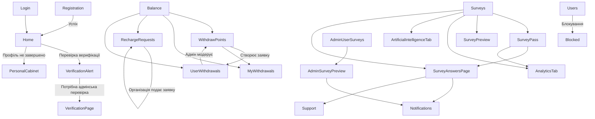

# Діаграма навігації по сторінках загальна
```mermaid
graph TD
    subgraph Layout
        Header
        Footer
    end

    Home -->|Перевірка верифікації| VerificationAlert
    Home -->|Профіль не завершено| PersonalCabinet
    Registration -->|Успіх| Home
    Login --> Home
    VerificationAlert -->|Потрібна адмінська перевірка| VerificationPage
    WithdrawPoints -->|Створює заявку| UserWithdrawals
    WithdrawPoints --> MyWithdrawals
    RechargeRequests -->|Організація подає заявку| RechargeRequests
    UserWithdrawals -->|Адмін модерує| WithdrawPoints
    Balance --> WithdrawPoints
    Balance --> MyWithdrawals
    Balance --> RechargeRequests
    Balance --> UserWithdrawals
    Surveys --> SurveyPass
    Surveys --> SurveyPreview
    Surveys --> AnalyticsTab
    Surveys --> ArtificialIntelligenceTab
    Surveys --> SurveyAnswersPage
    SurveyPass --> SurveyAnswersPage
    SurveyPass --> AnalyticsTab
    SurveyAnswersPage --> Notifications
    SurveyAnswersPage --> Support
    AdminUserSurveys --> AdminSurveyPreview
    AdminSurveyPreview --> Notifications
    Users -->|Блокування| Blocked

    %% Layout connections
    Home --> Header
    Home --> Footer
    Registration --> Header
    Registration --> Footer
    Login --> Header
    Login --> Footer
    VerificationAlert --> Header
    VerificationAlert --> Footer
    VerificationPage --> Header
    VerificationPage --> Footer
    WithdrawPoints --> Header
    WithdrawPoints --> Footer
    MyWithdrawals --> Header
    MyWithdrawals --> Footer
    UserWithdrawals --> Header
    UserWithdrawals --> Footer
    RechargeRequests --> Header
    RechargeRequests --> Footer
    Balance --> Header
    Balance --> Footer
    PersonalCabinet --> Header
    PersonalCabinet --> Footer
    Surveys --> Header
    Surveys --> Footer
    SurveyPass --> Header
    SurveyPass --> Footer
    SurveyPreview --> Header
    SurveyPreview --> Footer
    SurveyAnswersPage --> Header
    SurveyAnswersPage --> Footer
    AdminUserSurveys --> Header
    AdminUserSurveys --> Footer
    AdminSurveyPreview --> Header
    AdminSurveyPreview --> Footer
    AnalyticsTab --> Header
    AnalyticsTab --> Footer
    ArtificialIntelligenceTab --> Header
    ArtificialIntelligenceTab --> Footer
    Notifications --> Header
    Notifications --> Footer
    Users --> Header
    Users --> Footer
    Blocked --> Header
    Blocked --> Footer
    Support --> Header
    Support --> Footer
```

- **Home**
  - Перевіряє статус верифікації користувача → [VerificationAlert]
  - Перенаправляє на заповнення профілю → [PersonalCabinet]

- **Registration**
  - Реєстрація → автоматичний перехід на [Home] / [PersonalCabinet]

- **Login**
  - Вхід → [Home]

- **VerificationAlert**
  - Після успішної верифікації (якщо потрібна адмінська перевірка) → [VerificationPage]

- **VerificationPage** (admin)
  - Модерує організації

- **WithdrawPoints**
  - Подає заявку → [UserWithdrawals] (admin модерує)
  - Перегляд історії виведення → [MyWithdrawals]

- **RechargeRequests**
  - Організація подає заявку на поповнення → адмін бачить у [RechargeRequests]

- **UserWithdrawals** (admin)
  - Модерує заявки, створені в [WithdrawPoints]

- **Balance**
  - Інтегрує:
    - [WithdrawPoints]
    - [MyWithdrawals]
    - [RechargeRequests]
    - [UserWithdrawals]

- **PersonalCabinet**
  - Керує профілем
  - Відповідальний за завершення профілю → [Home]

- **Surveys**
  - Переходи:
    - Приймає запрошення → [SurveyPass]
    - Попередній перегляд → [SurveyPreview]
    - Аналітика → [AnalyticsTab]
    - AI допомога → [ArtificialIntelligenceTab]
    - Перегляд відповідей → [SurveyAnswersPage]

- **SurveyPass**
  - Відповіді → [SurveyAnswersPage], оновлення статистики → [AnalyticsTab]

- **SurveyPreview**
  - Перегляд структури перед публікацією

- **SurveyAnswersPage**
  - Перегляд відповідей користувачів
  - Надсилання сповіщень → [Notifications], [Support]

- **AdminUserSurveys** (admin)
  - Перехід до [AdminSurveyPreview]

- **AdminSurveyPreview** (admin)
  - Видалення опитування з повідомленням → [Notifications]

- **AnalyticsTab**
  - Показує статистику по опитуванню

- **ArtificialIntelligenceTab**
  - AI допомога по опитуваннях

- **Users** (admin)
  - Управління користувачами
  - Блокування → [Blocked]

- **Blocked**
  - Інформує користувача про блокування

- **Support**
  - Спілкування між користувачами та адміністрацією

- **Notifications**
  - Створення сповіщень (інтеграція з [SurveyAnswersPage], [AdminSurveyPreview])

- **TariffsPage**
  - Користувач може купити тариф

- **News**
  - Перегляд та керування новинами

- **AdminLogs** (admin)
  - Перегляд системних логів

- **ServerDown**
  - Статична сторінка при помилці сервера

- **Header**  
  - Верхня навігаційна панель з вкладками для різних ролей (адмін, клієнт, організація)  
  - Індикатори сповіщень, повідомлень, статусів верифікації  
  - Доступ до профілю користувача та вихід із системи

- **Footer**  
  - Універсальний футер з інформаційними посиланнями, політикою конфіденційності та іконками соцмереж  
  - Відображається на всіх сторінках платформи

## Системні залежності
### Python пакети
```bash
altgraph==0.17.4
annotated-types==0.7.0
anyio==4.8.0
APScheduler==3.11.0
apsw==3.49.1.0
asgiref==3.8.1
attrs==24.2.0
audioread==3.0.1
bcrypt==4.3.0
beautifulsoup4==4.13.3
bidict==0.23.1
bleach==6.2.0
blinker==1.8.2
bs4==0.0.2
cachetools==5.5.2
certifi==2024.8.30
cffi==1.17.1
charset-normalizer==3.4.1
click==8.1.7
colorama==0.4.6
contourpy==1.3.1
cryptography==44.0.2
cycler==0.12.1
decorator==5.1.1
Deprecated==1.2.18
docstring_parser==0.16
duckdb==1.2.2
fastapi==0.115.6
filelock==3.18.0
Flask==3.0.3
Flask-Cors==5.0.0
Flask-Limiter==3.12
Flask-SQLAlchemy==3.1.1
fonttools==4.56.0
fsspec==2025.3.2
google-ai-generativelanguage==0.6.15
google-api-core==2.24.2
google-api-python-client==2.167.0
google-auth==2.38.0
google-auth-httplib2==0.2.0
google-auth-oauthlib==1.2.1
google-cloud-aiplatform==1.88.0
google-cloud-bigquery==3.31.0
google-cloud-core==2.4.3
google-cloud-resource-manager==1.14.2
google-cloud-storage==2.19.0
google-crc32c==1.7.1
google-generativeai==0.8.4
google-resumable-media==2.7.2
googleapis-common-protos==1.70.0
greenlet==3.1.1
grpc-google-iam-v1==0.14.2
grpcio==1.72.0rc1
grpcio-status==1.71.0
h11==0.14.0
httplib2==0.22.0
huggingface-hub==0.30.2
idna==3.10
imageio==2.37.0
itsdangerous==2.2.0
Jinja2==3.1.4
joblib==1.4.2
jsonify==0.5
keyboard==0.13.5
kiwisolver==1.4.8
lazy_loader==0.4
librosa==0.10.2.post1
limits==4.7.3
llvmlite==0.44.0
lxml==5.3.1
markdown-it-py==3.0.0
MarkupSafe==3.0.2
matplotlib==3.10.0
mdurl==0.1.2
MouseInfo==0.1.3
mpmath==1.3.0
msgpack==1.1.0
Naked==0.1.32
narwhals==1.28.0
numba==0.61.0
numpy==2.1.3
oauthlib==3.2.2
ordered-set==4.1.0
outcome==1.3.0.post0
packaging==24.2
pandas==2.2.3
pdfminer.six==20250327
pefile==2024.8.26
pillow==11.1.0
platformdirs==4.3.6
plotly==6.0.0
pooch==1.8.2
proto-plus==1.26.1
protobuf==5.29.4
pyasn1==0.6.1
pyasn1_modules==0.4.2
PyAutoGUI==0.9.54
pycparser==2.22
pycryptodome==3.21.0
pydantic==2.10.5
pydantic_core==2.27.2
pygame==2.6.1
PyGetWindow==0.0.9
Pygments==2.19.1
pyinstaller==6.10.0
pyinstaller-hooks-contrib==2024.8
PyJWT==2.10.1
PyMsgBox==1.0.9
pynput==1.7.7
pyotp==2.9.0
pyparsing==3.2.0
pyperclip==1.9.0
PyRect==0.2.0
PyScreeze==1.0.1
PySocks==1.7.1
python-dateutil==2.9.0.post0
python-docx==1.1.2
python-dotenv==1.0.1
python-engineio==4.9.1
python-socketio==5.11.4
pytweening==1.2.0
pytz==2025.1
pywin32-ctypes==0.2.3
PyYAML==6.0.2
qrcode==8.0
recaptcha==1.0rc1
regex==2024.11.6
requests==2.32.3
requests-oauthlib==2.0.0
rich==13.9.4
rsa==4.9
safetensors==0.5.3
scapy==2.6.1
scikit-learn==1.6.1
scipy==1.15.2
seaborn==0.13.2
selenium==4.25.0
selenium-stealth==1.0.6
setuptools==78.1.0
shapely==2.1.0
shellescape==3.8.1
simple-websocket==1.0.0
six==1.16.0
sniffio==1.3.1
sortedcontainers==2.4.0
soundfile==0.12.1
soupsieve==2.6
soxr==0.5.0.post1
SQLAlchemy==2.0.38
sqlcipher3-wheels==0.5.4.post0
starlette==0.41.3
sympy==1.13.3
threadpoolctl==3.5.0
tokenizers==0.21.1
tqdm==4.67.1
transformers==4.51.3
trio==0.26.2
trio-websocket==0.11.1
typing_extensions==4.12.2
tzdata==2024.2
tzlocal==5.2
uritemplate==4.1.1
urllib3==2.2.3
webencodings==0.5.1
websocket-client==1.8.0
Werkzeug==3.0.4
wheel==0.45.1
wrapt==1.17.2
wsproto==1.2.0
```
(повний список залежностей в `full_report.txt`)

### Frontend пакети
```bash
├── @react-oauth/google@0.12.1
├── autoprefixer@10.4.21
├── chart.js@4.4.8
├── framer-motion@12.6.5
├── postcss@8.5.3
├── react-chartjs-2@5.3.0
├── react-google-recaptcha@3.1.0
├── react-router-dom@7.1.1
└── tailwindcss@4.1.3
├── @eslint/js@9.17.0
├── @types/react-dom@18.3.5
├── @types/react@18.3.18
├── @vitejs/plugin-react@4.3.4
├── axios@1.7.9
├── eslint-plugin-react-hooks@5.1.0
├── eslint-plugin-react-refresh@0.4.16
├── eslint-plugin-react@7.37.3
├── eslint@9.17.0
├── globals@15.14.0
├── react-datepicker@7.6.0
├── react-dom@18.3.1
├── react-icons@5.5.0
├── react-router-dom@7.1.1
├── react-select@5.9.0
├── react@18.3.1
└── vite@6.0.7
```

## Системні вимоги
- **OS**: Windows 11
- **Python**: 3.13.2
- **Node.js**: 20.11.1
- **npm**: 10.2.4

## Контактна інформація
- Автор: Начинка Анастасія Андріївна
- Платформа: OwlView

